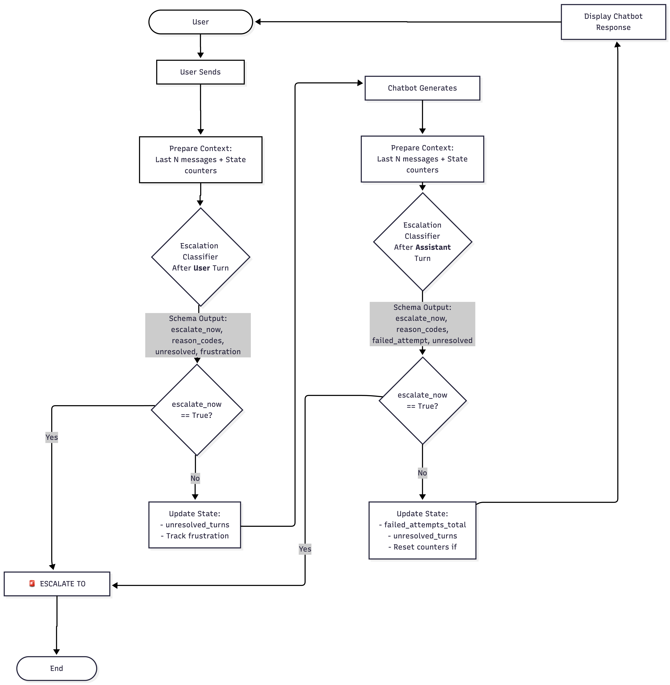

# How the Chatbot Escalation System Works

## Overview

This system monitors customer support conversations in real-time and automatically decides when to escalate to a human agent. It uses an LLM-based classifier with deterministic state tracking to make intelligent escalation decisions at each turn of the conversation.

## Core Workflow



### 1. User Sends Message
When a user sends a message in the chat:

**→ First Classification (After User Turn)**
- The system takes the **last N messages** (default: 8) as context
- Adds current **state counters** (failed_attempts, unresolved_turns)
- Sends to LLM classifier which returns:
  - `escalate_now`: Should we escalate right now?
  - `reason_codes`: Why or why not? (e.g., USER_REQUESTED_HUMAN, CHURN_RISK)
  - `unresolved`: Is the user's issue still unresolved?
  - `frustration`: User's frustration level (none/mild/high)

**→ Decision Point #1**
- If `escalate_now = True` → **Escalate to human agent immediately**
- If `escalate_now = False` → Update state counters and continue

### 2. Chatbot Generates Response
If not escalated, the support chatbot generates a response to help the user.

**→ Second Classification (After Assistant Turn)**
- Again takes **last N messages** + **updated state counters**
- Sends to LLM classifier which returns:
  - `escalate_now`: Should we escalate after this response?
  - `reason_codes`: Explanation (e.g., REPEATED_FAILURE, RESOLVED_CONFIRMED)
  - `failed_attempt`: Did the assistant fail to provide helpful answer?
  - `unresolved`: Is the issue still unresolved?

**→ Decision Point #2**
- If `escalate_now = True` → **Escalate to human agent**
- If `escalate_now = False` → Update state counters and show response to user

### 3. Update State & Repeat
State counters are updated deterministically:
- **failed_attempts_total**: Increments when `failed_attempt = true`
- **unresolved_turns**: Increments when `unresolved = true`, resets to 0 when resolved
- Both counters reset when issue is resolved

Then the cycle repeats from step 1.

## Key Design Features

### Dual Classification
The system checks for escalation **twice per conversation turn**:
1. **After user message** - Catches urgent signals (frustration, explicit requests)
2. **After chatbot response** - Evaluates if assistant helped or failed

This ensures upset users don't wait unnecessarily for a chatbot response.

### Rolling Context Window
Only the **most recent N messages** are sent to the classifier (not the entire conversation history). This:
- Keeps costs bounded
- Focuses on recent context
- Scales to long conversations

### Deterministic State Tracking
Two simple counters track escalation-relevant signals across the conversation:
- **failed_attempts_total** - How many times the assistant failed
- **unresolved_turns** - How long the issue has persisted

These provide memory beyond the context window without overwhelming the LLM.

### Structured Output Schema
The LLM returns validated JSON with specific fields, ensuring reliable decisions:
```python
{
  "escalate_now": bool,
  "reason_codes": ["USER_REQUESTED_HUMAN", "CHURN_RISK", ...],
  "failed_attempt": bool,  # Assistant turn only
  "unresolved": bool,
  "frustration": "none" | "mild" | "high"
}
```

### Reason Codes as Rubric
The escalation logic is expressed as a closed set of reason codes:

**Escalate When:**
- USER_REQUESTED_HUMAN
- CHURN_RISK
- REPEATED_FAILURE
- ASSISTANT_IRRELEVANT_OR_INCOMPLETE
- INSTRUCTIONS_DID_NOT_WORK
- URGENT_OR_HIGH_STAKES
- CAPABILITY_OR_POLICY_BLOCK

**Don't Escalate When:**
- HOW_TO_SOLVABLE
- RESOLVED_CONFIRMED
- SMALL_TALK_OR_GREETING
- TROUBLESHOOTING_IN_PROGRESS
- NEED_MORE_INFO

## Example Flow

```
User: "I can't log in to my account"
  → Classifier: escalate_now=false, reason=TROUBLESHOOTING_IN_PROGRESS, unresolved=true
  → State: unresolved_turns=1

Bot: "Try resetting your password at example.com/reset"
  → Classifier: escalate_now=false, reason=HOW_TO_SOLVABLE, failed_attempt=false, unresolved=true
  → State: unresolved_turns=2

User: "Tried that, still doesn't work"
  → Classifier: escalate_now=false, reason=TROUBLESHOOTING_IN_PROGRESS, unresolved=true, frustration=mild
  → State: unresolved_turns=3

Bot: "Let me help you further..."
  → Classifier: escalate_now=false, reason=TROUBLESHOOTING_IN_PROGRESS, failed_attempt=false, unresolved=true
  → State: unresolved_turns=4

User: "This is ridiculous! I need to talk to someone NOW"
  → Classifier: escalate_now=true, reason=[USER_REQUESTED_HUMAN, CHURN_RISK], frustration=high
  → ESCALATE TO HUMAN AGENT
```

## Technology Stack

- **LLM**: LangChain-based with support for OpenAI, Anthropic, Google, or custom endpoints
- **Validation**: Pydantic for structured output schemas
- **Configuration**: YAML for model settings, environment variables for API keys
- **Interface**: CLI for interactive chat and dataset evaluation

## Modularity

The system is designed to be easily extensible:
- Swap LLM classifier for ML model or rules-based logic (via `BaseEscalationClassifier` interface)
- Change context window size via config
- Add new reason codes to the schema
- Switch between different LLM providers via config
