# System Flow Diagrams

This document contains visual representations of the Chatbot Escalation Decision System architecture and flow.

## 1. Main Conversation Flow

This diagram shows the turn-by-turn flow from user input through escalation decision and chatbot response.

```mermaid
flowchart TD
    Start([User Starts Conversation]) --> UserMsg[User Sends Message]
    
    UserMsg --> PrepareContext1[Prepare Context:<br/>Last N messages + State counters]
    PrepareContext1 --> Classifier1{Escalation Classifier<br/>After User Turn}
    
    Classifier1 --> |"Schema Output:<br/>escalate_now, reason_codes,<br/>unresolved, frustration"| CheckEscalate1{escalate_now<br/>== True?}
    
    CheckEscalate1 --> |Yes| Escalate[🚨 ESCALATE TO HUMAN]
    Escalate --> End([End Conversation])
    
    CheckEscalate1 --> |No| UpdateState1[Update State:<br/>- unresolved_turns<br/>- Track frustration level]
    
    UpdateState1 --> ChatBot[Chatbot Generates Response]
    
    ChatBot --> PrepareContext2[Prepare Context:<br/>Last N messages + State counters]
    PrepareContext2 --> Classifier2{Escalation Classifier<br/>After Assistant Turn}
    
    Classifier2 --> |"Schema Output:<br/>escalate_now, reason_codes,<br/>failed_attempt, unresolved"| CheckEscalate2{escalate_now<br/>== True?}
    
    CheckEscalate2 --> |Yes| Escalate
    
    CheckEscalate2 --> |No| UpdateState2[Update State:<br/>- failed_attempts_total<br/>- unresolved_turns<br/>- Reset counters if resolved]
    
    UpdateState2 --> Display[Display Chatbot Response<br/>to User]
    
    Display --> UserMsg
    
    style Escalate fill:#ff6b6b,stroke:#c92a2a,color:#fff
    style Classifier1 fill:#4dabf7,stroke:#1971c2,color:#fff
    style Classifier2 fill:#4dabf7,stroke:#1971c2,color:#fff
    style ChatBot fill:#51cf66,stroke:#2f9e44,color:#fff
    style UpdateState1 fill:#ffd43b,stroke:#fab005
    style UpdateState2 fill:#ffd43b,stroke:#fab005
```

**Key Points:**
- **Dual Classification**: Escalation is checked after BOTH user and assistant turns
- **Rolling Context**: Only last N messages (default: 8) are passed to classifier
- **State Tracking**: Deterministic counters maintained across turns
- **Decision Schema**: Structured output with specific fields for each turn type

---

## 2. State Management Logic

This diagram details how deterministic state counters are updated based on classifier output.

**State Counter Rules:**
- `failed_attempts_total`: Increments when assistant provides unhelpful response
- `unresolved_turns`: Consecutive turns where issue remains unresolved
- **Reset Condition**: Both counters reset to 0 when issue is resolved (unresolved = false)

---

## 3. System Architecture

This diagram shows the modular component structure and data flow.

**Modularity Benefits:**
- **Swappable Classifiers**: Any classifier inheriting from `BaseEscalationClassifier` can replace LLM version
- **Multi-Model Support**: Factory pattern with config-based model selection
- **Clean Interfaces**: Separation between state, schema, and decision logic

---

## 4. Context Window Management

This diagram illustrates how the rolling context window is maintained.

**Context Strategy:**
- **Bounded Window**: Prevents unbounded context growth
- **Recency Bias**: Most recent exchanges are most relevant
- **State Persistence**: Counters carry historical information forward

---

## 5. Escalation Decision Schema

Visual representation of the structured output returned by the classifier.

---

## Design Principles

### Why Dual Classification (User + Assistant Turns)?
- **Customer Satisfaction Priority**: Catch escalation signals immediately when user expresses frustration
- **No Waiting**: Don't force upset users to wait for chatbot response
- **Responsive**: Better handling of urgent situations and emotional states

### Why Rolling Context Window?
- **Scalability**: Prevents unbounded context growth in long conversations
- **Cost Efficiency**: Reduces tokens sent to LLM
- **Focus**: Recent messages are most relevant for escalation decisions

### Why Deterministic State Tracking?
- **Stability**: Single misclassification won't dominate outcome
- **Transparency**: Counter logic is explicit and auditable
- **Tunability**: Easy to adjust thresholds without retraining

### Why Structured Output?
- **Reliability**: Type-safe, validated responses
- **Explainability**: Reason codes provide clear decision rationale
- **Monitoring**: Structured data enables metrics and analysis
